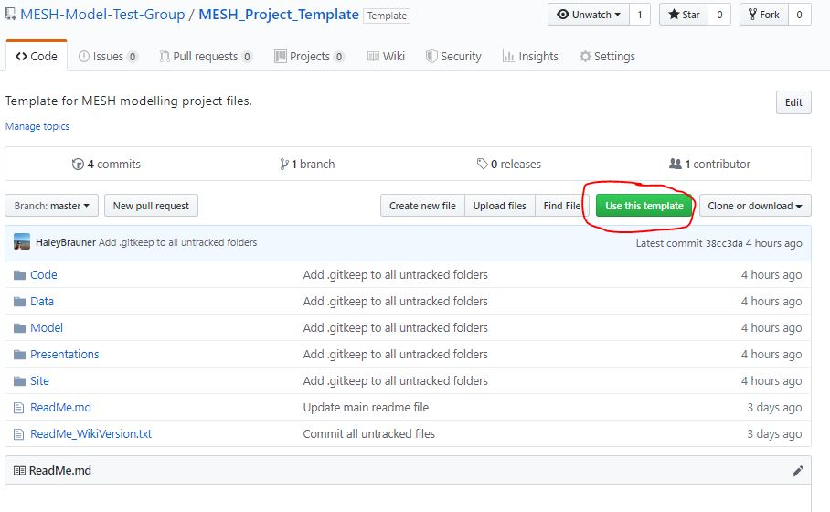

## This repository is a template for individual MESH modelling projects and contain information about a basin and modelling activities conducted using MESH.

- Each repository stored on GitHub is limited to **1 GB** (see [here](https://help.github.com/en/github/managing-large-files/what-is-my-disk-quota) for more details)
- No one file may be larger than **100 MB**
- Include large files in a .gitignore file and include a push/pull script corresponding to the storage location on a Server (e.g. Graham)
  - For more information about .gitignore files, see the GitHub manual [here](https://git-scm.com/book/en/v2/Git-Basics-Recording-Changes-to-the-Repository#_ignoring) or a repoistory with some example .gitignore files [here](https://github.com/github/gitignore).

To create a new basin repository:
1. Click "Use this template" from the MESH_Project_Template repository page

2. Name the new repository "MESH_Project_<Watershed Name>" (ex. "MESH_Project_Baker_Creek")

3. Update the main "ReadMe.md" and "ProjectOverview.md" documents with project-specific information, and populate the folders.

# Project Title

## Team
  *Include the name of modeller(s), advisors, and other contributors involved in the project here, as well as key contact information*

## Date
*Date(s) of the project*

## Purpose
  *Give a brief summary of the purpose of the modelling project here*

## Objectives and Main Tasks
  *List the objectives of the modelling, as well as a summary of the project structure and tasks completed*

## Basin Meta-data
*Include a link to the MESH Wiki "Basin Meta-data" page, if created. Otherwise, link to a "Basin_Metadata.md" file in the "Site" folder

[Basin Meta-data on MESH Wiki Page](https://wiki.usask.ca/display/MESH/Basin+Meta-data) *Update to go directly to the basin page*

[Basin Meta-data File](https://github.com/HaleyBrauner/MESH_Repo_Template/blob/master/Site/BasinMetaData.md)

## Progress / Conclusion
*Include periodic updates on the modelling progress here, or even just "in progress"*
*Include the main findings of the modelling, and further recommendations*

## References
- List any scripts, packages, etc. used
- Related research papers and other information (theory, parameter selection, etc.); could include a copy in Model>Justification folder
- Manuals (ex. CLASS, Ostrich, MESH Wiki, other)

___
___
# Folder Structure
Given the file size limitations of GitHub, only smaller files are stored here and the rest are stored on Graham. The files can be synced with the local machine via the respective push/pull bash scripts included in the Data/Raw and Model folders.

## Code
- Includes pre- and post-processing scripts used in the project

## Data

### Raw
- Include raw data files here. It is best to change the permissions to "Read Only".

### Processed
- Includes processed driving data, spatial data, and validation data (ex. streamflow).

#### Driving
- *Processed driving data used in the model*
- *Scripts used to generate the files should be included in the "Code" folder*

#### Spatial
- *Ex. GIS files, Green Kenue files*

#### Validation
- *ex. streamflow*

## Model
- *The ReadMe files should give an overview of the modelling methodology, as well as the differences between scenarios/runs*
- *Include model notes in this main "Model" folder, as available*

### Justification
- *Include files related to scenario configuration choice, parameter selection, initial conditions, etc.*

### MESH_Code
- *Holds the MESH code used for running the mode; use a new folder for each version (include the version as a suffix)*
- *If any modification of the code were made, or more than one version was used, include a text file listing the MESH code versions, the main differences and reason for use, and details of the modifications*

### Ostrich
- *This folder contains a copy of the Ostrich program (uncompiled); be sure to put the compiled file in .gitignore*

### ConfigurationX*
*1 folder for each configuration, each with input and output sub-folders*

- Input  
  - *Includes the MESH inputs files, driving data files / symbolic links, and scripts for running the model*

- Output
  - *Includes the output files for the model configuration / each run*

## Presentations
- *Contains powerpoint (or similar), poster, or other presentations or reports related to the project (formal or otherwise)*

## Site
*Can include:
- Maps
- PhotosVideos
- Site Meta-data
- etc.*
